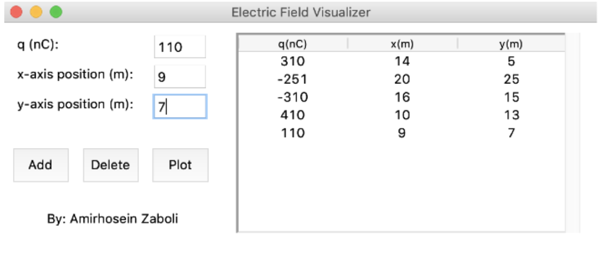
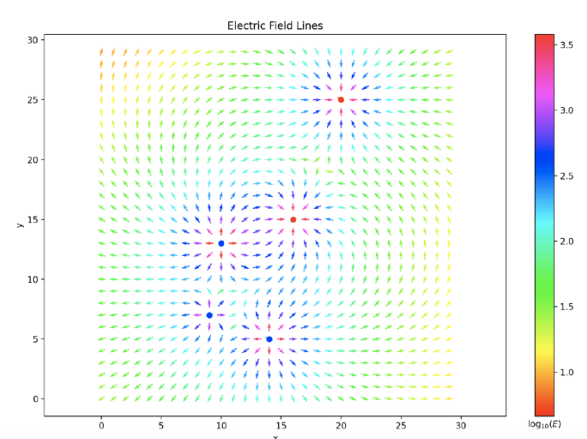

# Electric Field Visualizer
This is a project for EM course to give students a better understanding of how charged particles are affected by electric fields.

## Prerequisite
In order to run the code, make sure you have followings installed on your device:
* numpy
* matplotlib
* Tkinter

## How does it work?
A PDF file in Persian is provided. An English description will soon be added.

## Screenshots

